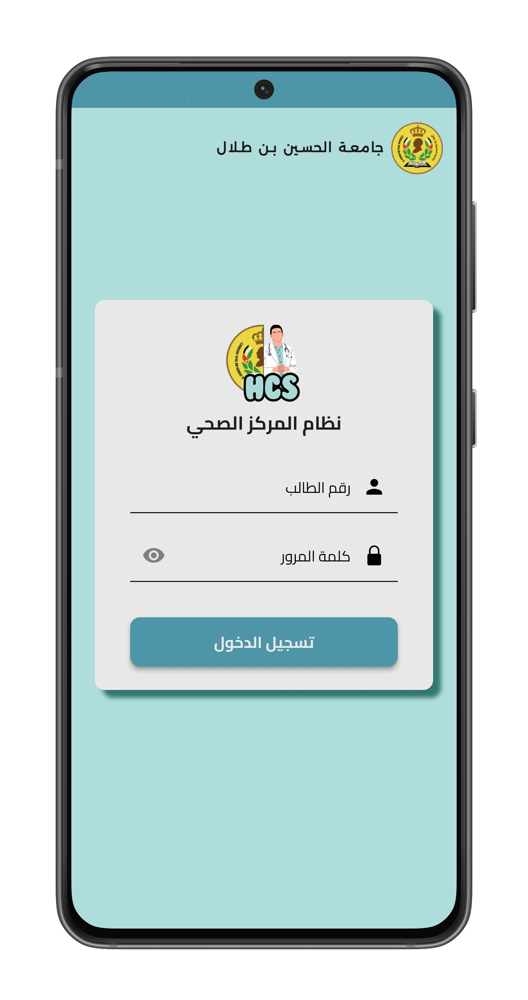
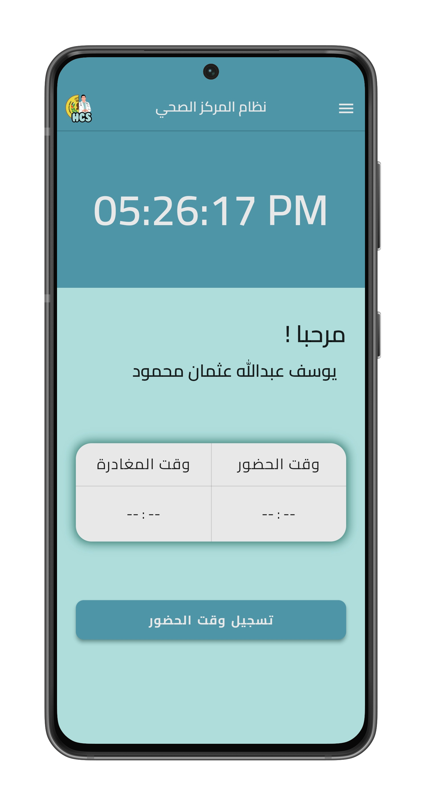
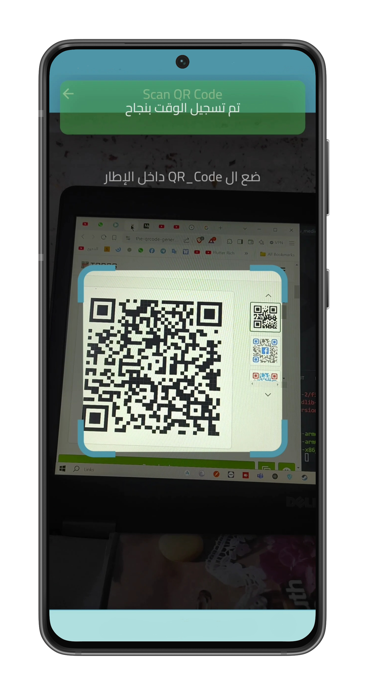
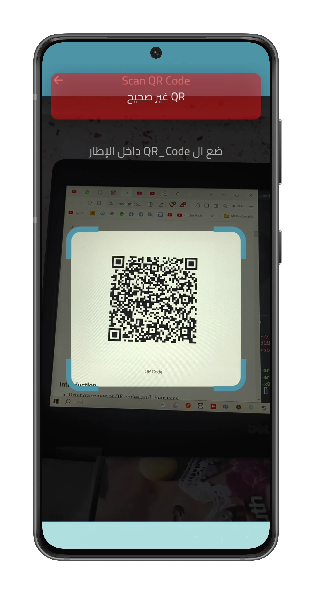
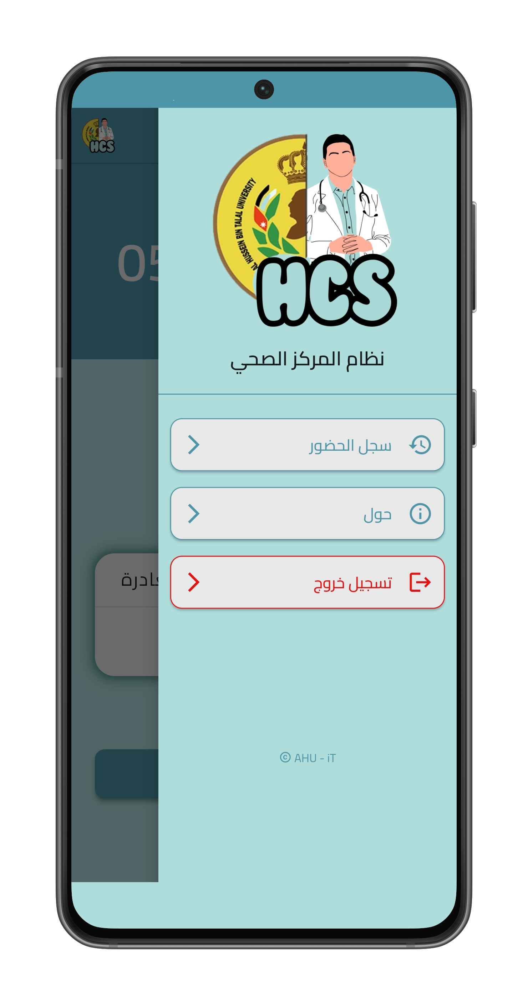
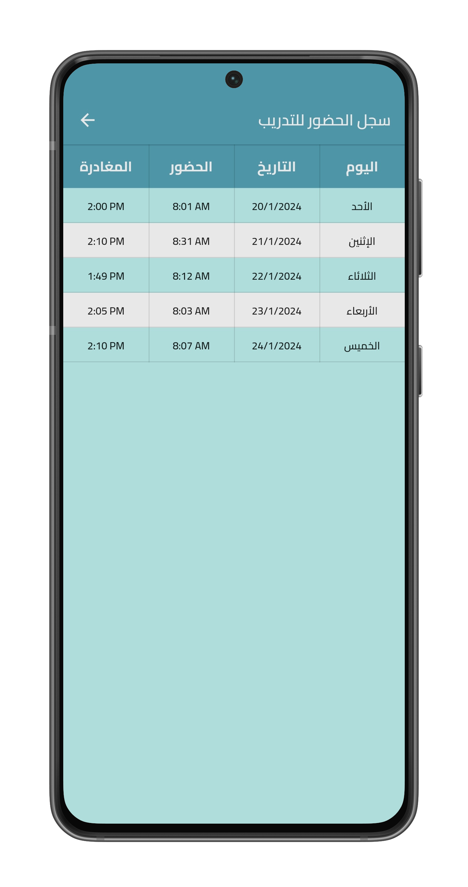

# 🏥 AHU Healthcare System

A mobile application developed for the **AHU Healthcare System** to monitor **intern attendance** using **QR code check-in and check-out**.  
This system improves the **reliability**, **efficiency**, and **transparency** of managing intern shifts by enabling real-time tracking and accurate record-keeping.

---

## 📲 Features

- 🔐 **Secure Login** for interns
- 🏠 **Home Dashboard** with shift overview
- 📷 **QR Code Scanner** for check-in / check-out
- ✅ **Real-time Feedback** for successful or failed scans
- 📊 **Attendance History** for users
- 📂 **Navigation Drawer** with profile and logout options

---

## 📸 Screenshots

<table>
  <tr>
    <td align="center">
      
    </td>
    <td align="center">
      
    </td>
  </tr>
  <tr>
    <td align="center">
      
    </td>
    <td align="center">
      
    </td>
  </tr>
   <tr>    
    <td align="center">
      
    </td>
    <td align="center">
      
    </td>
  </tr>
</table>


---

## 🚀 Getting Started

1. **Clone the repository**
```bash
git clone https://github.com/yousef-mahmoud-2002/AHU_HCS.git
